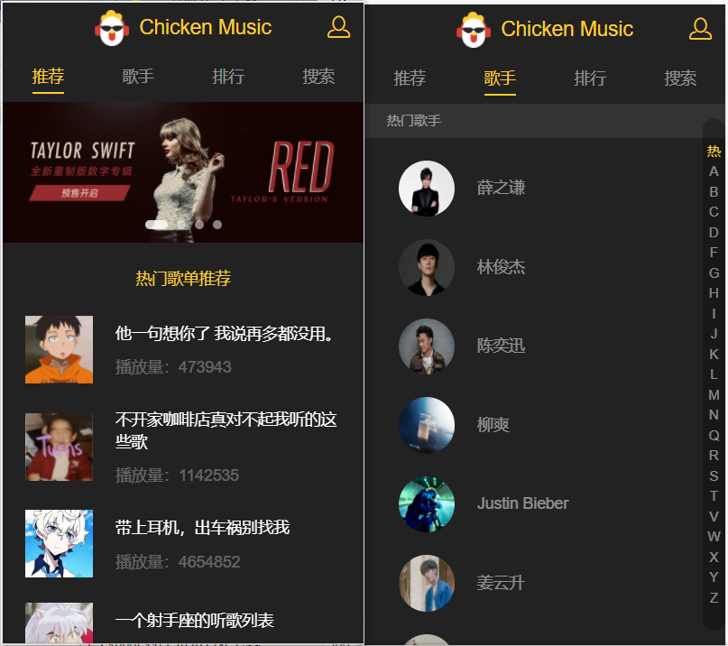
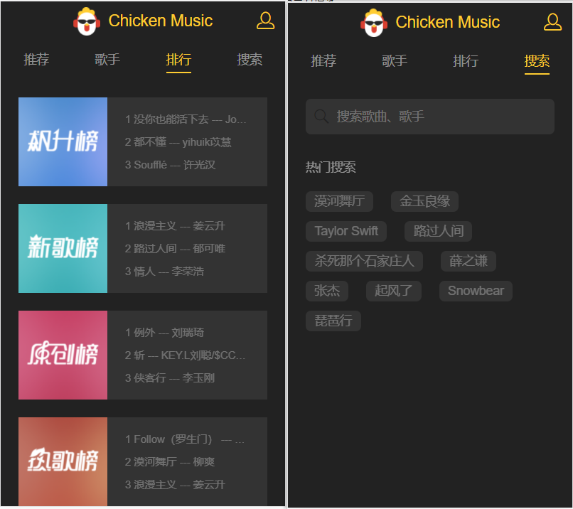
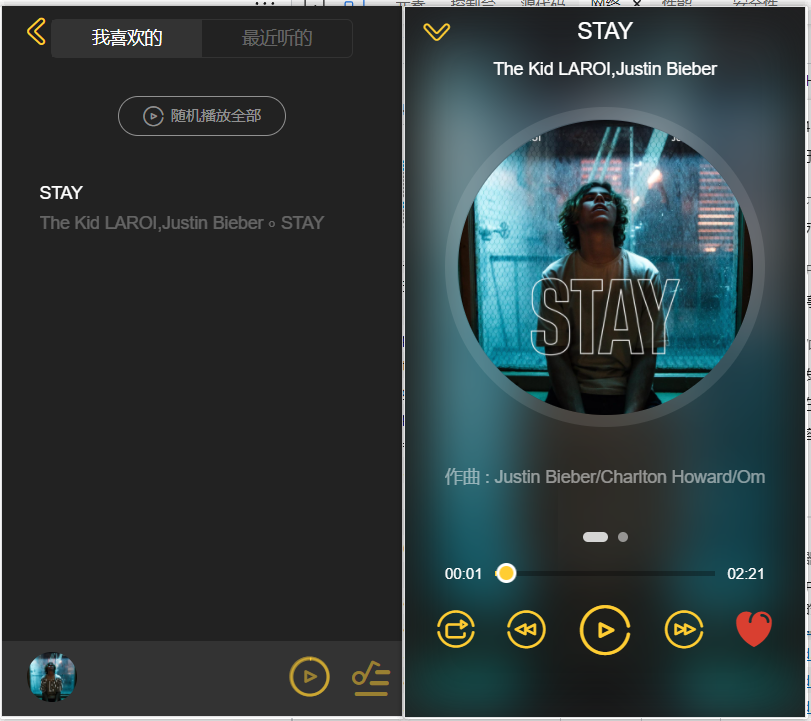
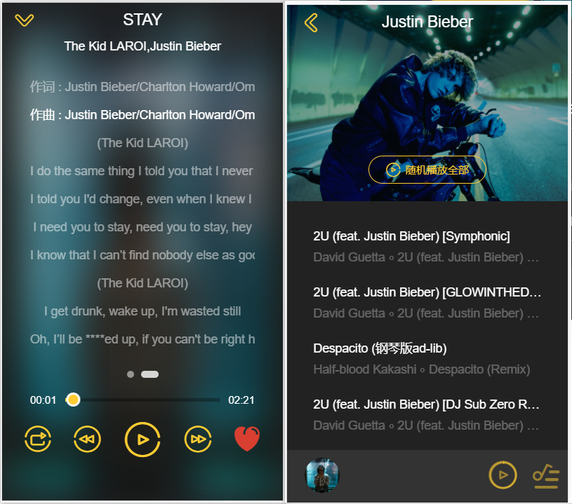
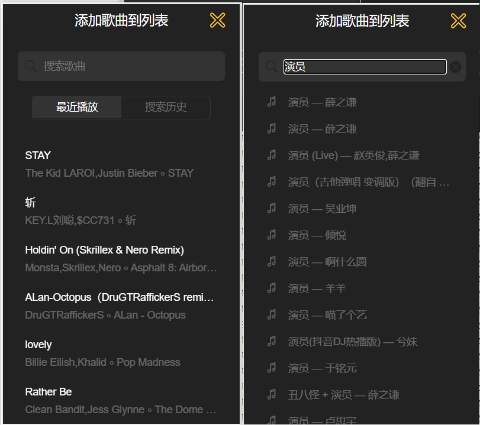
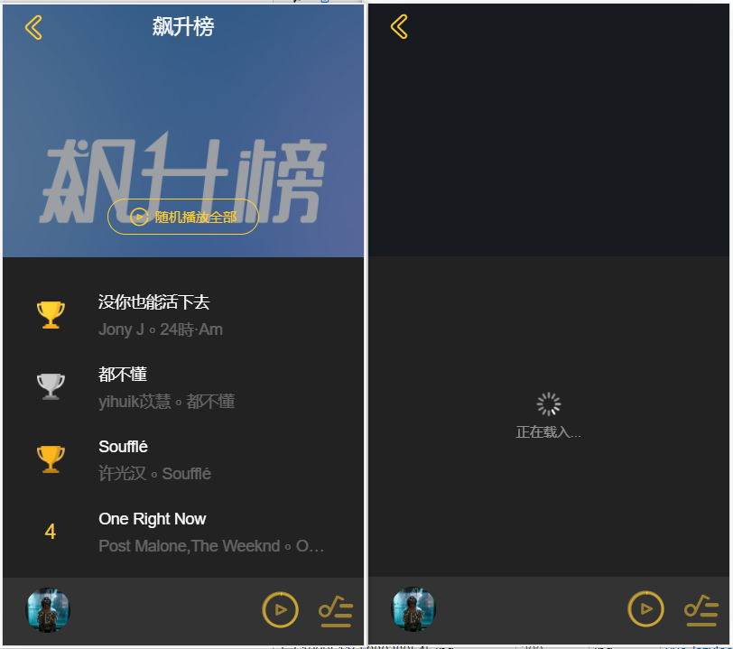
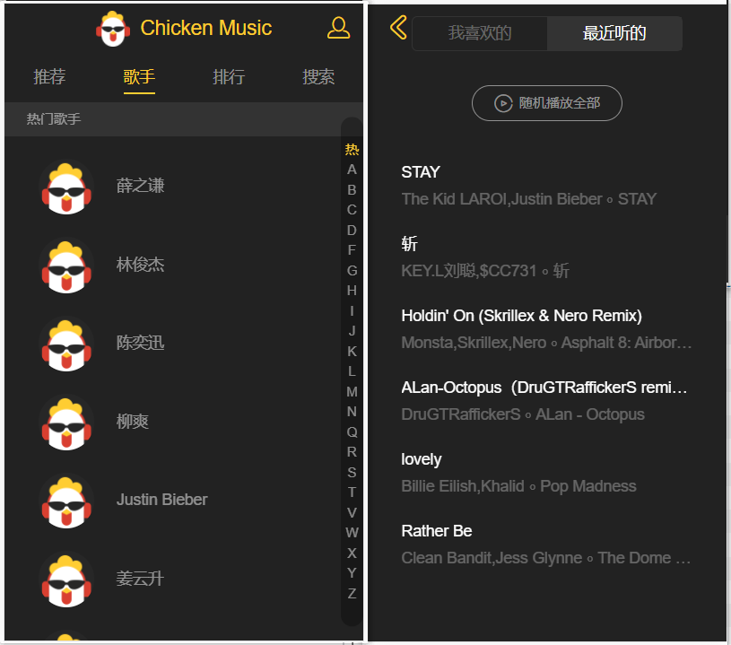

# vue-music

> 音乐播放器

## 如何启动

``` bash
# 安装依赖
npm install

# serve with hot reload at localhost:8080
npm run dev

# 浏览器输入 localhost:8080
打开浏览器
```

##### 介绍

此程序是由 vue2 开发的移动端音乐播放器，接口替换为了网易云接口


##### 接口

[网易云api NodeJS版]: https://neteasecloudmusicapi.vercel.app/#/?id=neteasecloudmusicapi


##### 概览
















